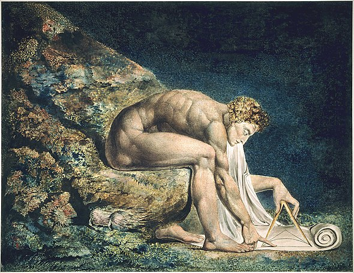
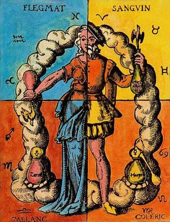
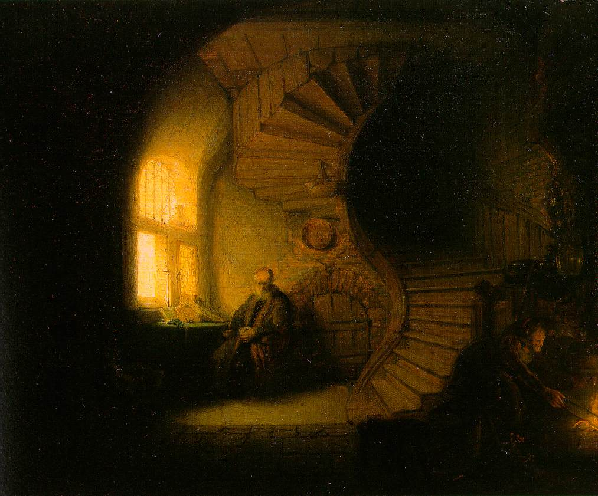
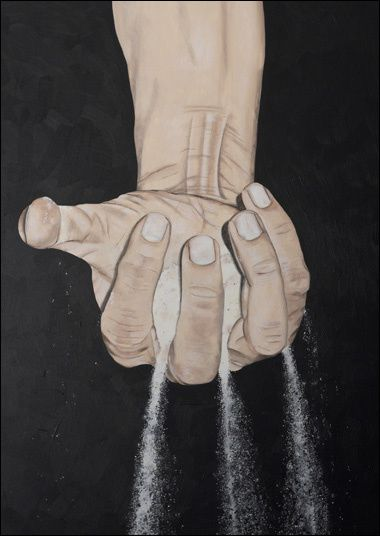
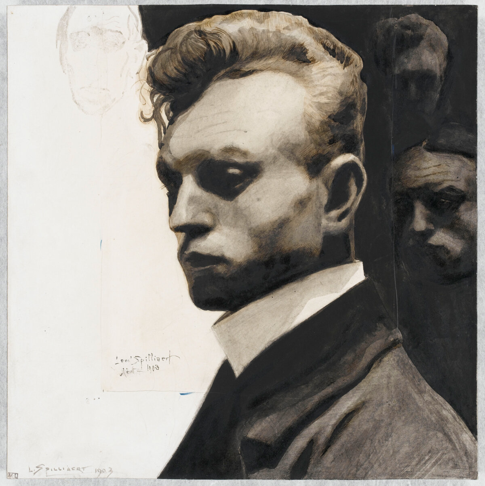
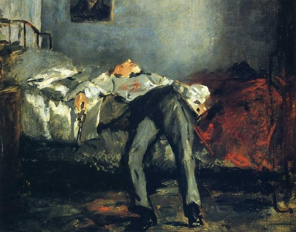

&nbsp;

# [L’Art d’être heureux][livre], Schopenhauer :  

&nbsp;

["L'art d'être heureux"][livre] est un livre de [Arthur Schopenhauer][schopenhauer], dans lequel le philosophe allemand propose sa vision du [bonheur][bonheur] et de la [sagesse][sagesse]. Il y expose sa conception de la vie bonne, fondée sur la philosophie de l'[ascétisme][ascétisme] et la renonciation aux [désirs][désir] inutiles. Schopenhauer y présente également sa théorie des [humeurs][humeur], selon laquelle l'état d'esprit est déterminant pour la perception de la réalité, ainsi que sa vision [pessimiste][pessimisme] de l'existence humaine.

Le [livre][livre] est divisé en cinquantes règles de vies, chacune abordant un aspect particulier de l'art d'être heureux, tels que la [solitude][solitude], la [santé][santé], la [mort][mort], la [sagesse][sagesse], la [morale][morale], etc. Bien que l'ouvrage ait été écrit dans le contexte de la pensée de [Schopenhauer][schopenhauer], ses réflexions sur le [bonheur][bonheur] et la sagesse restent d'actualité et continuent d'inspirer les lecteurs à la recherche d'une vie épanouissante et pleine de sens.

&nbsp;

## Le déterminisme Schopenhauerien
---

&nbsp;\
Le livre aborde l'idée du [déterminisme][determinisme], qui est la [croyance][croyance] selon laquelle chaque événement est déterminé par des [causes][causalisme] antérieures et extérieures, impliquant que notre [destin][destin] est déjà écrit et que nous n'avons aucun [libre arbitre][libre_arbitre] et donc peu de contrôle sur notre vie. 

Celle-ci est considérée par l'auteur comme une succession d'événements et de [décisions][action] que nous prenons, et dont nous sommes [conscients][conscience] uniquement dans le présent. D'où la difficulté d'anticiper nos décisions et leurs répercutions à l'avance. [Schopenhauer][schopenhauer] utilise dans son livre une métaphore pour décrire la vie comme étant un bateau qui doit atteindre un certain cap - une [volonté][volonté], mais qui est continuellement influencé par les vents - les événements, ce qui nous empêche de voguer droit sur ce cap et nous oblige à toujours réajuster la barre. 

Cependant, l'auteur suggère l'existence d'un [libre arbitre][libre_arbitre], dans la mesure où nous avons le choix de nous auto-contraindre, c'est-à-dire de restreindre nos possibilités d'[actions][action] à une portée réaliste. Il compare sa pensée à un cercle représentant notre vie et nos possibilités, et où le libre arbitre serait la possibilité de choisir un rayon - d'[action][action] inférieur au cercle précédent. 

Il préconise toutefois d'accepter une certaine forme de [fatalisme][fatalisme], qui est la [croyance][croyance] que chaque événement est nécessaire et que nous n'avons aucun contrôle sur notre [destin][destin]. L'auteur exprime que son déni mène à la [souffrance][souffrance], car nous imaginons toujours un champ des possibles plus grand que celui de la [réalité][réalité] et nous nous en retrouvons déçus une fois qu'on a atteint cette réalisation. Selon lui, tout ce qui peut arriver est nécessaire, et ce qui arrive est inévitable ; le potentiel réalistique imaginé des événements qui n'arrivent jamais tend donc à nous rendre malheureux. 

&nbsp;

Ces [décisions][action], ainsi que toutes celles que nous prenons sont cependant également sujettes à des influences ; externe - les événements de la vie ; et interne notamment à travers notre caractère et notre [humeur][humeur]. 

Cette notion de caractère est abordée par [Schopenhauer][schopenhauer] en tant qu'[essence][essence] de l'individu, sa [nature][nature] profonde et immuable. Selon lui, notre caractère est [déterminé][determinisme] dès la naissance, et nous ne pouvons pas le changer ou le modifier de manière significative au cours de notre vie. \
Il considère que l'homme est fondamentalement un être de [volonté][volonté], et que cette volonté est la force motrice derrière toutes nos [actions][action] et nos décisions. Ainsi, notre caractère est la manifestation de cette volonté, et il détermine la façon dont nous réagissons aux événements de notre vie. 

Quant à l'[humeur][humeur], il serait un état mental, oscillant entre [bien-être][bien-être] et [souffrance][souffrance], et qui influencerait notre perception du monde et notre manière de vivre. Schopenhauer considère que notre humeur est [déterminée][determinisme] par des facteurs internes tels que notre constitution physique, notre caractère, notre [santé][santé] mentale ou physique, ainsi que par des facteurs externes tels que les événements de la vie, les interactions sociales ou l'environnement. Il pense ainsi que l'humeur peut avoir une influence considérable sur notre vie et notre [bonheur][bonheur], et qu'il est important de chercher à la maîtriser. 

Enfin, Schopenhauer dénote l'importance de ces deux notions dans son approche [eudémonique][eudémonie]. Notre caractère et notre humeur seraient à la fois la source de notre bonheur et de notre souffrance. Ainsi, si ceux-ci sont en harmonie avec les circonstances de notre vie, la souffrance est moindre et le bonheur devient facile, mais si, au contraire, notre caractère et notre humeur rentrent en conflit avec les événements de notre vie, celle-ci devient difficile et la souffrance pèse sur elle. 

&nbsp;

[Schopenhauer][schopenhauer], réalisant le peu de [libre arbitre][libre_arbitre] dont nous disposons, va alors se mettre à la recherche d'un moyen de s'adapter à la vie, et de la rendre plus facile - plutôt que de chercher à la soummettre à lui. Il va donc chercher à comprendre comment il peut se rendre plus heureux, et comment il peut atteindre un [bonheur][bonheur] relatif, et ce à travers une définition qui lui est propre.

&nbsp;

## Bonheur ou moindre souffrance
---

&nbsp;\
La notion de [bonheur][bonheur] chez [Schopenhauer][schopenhauer] est en effet très particulière, il ne voit pas le bonheur comme une chose positive en soi, mais plutôt comme l'idée de la [souffrance][souffrance] moindre. Il donne ainsi plusieurs conseils afin d'atteindre ce bonheur. 

Parmis ceux-ci, mettre tous ses efforts dans l'éloignement des [souffrances][souffrance], ne jamais envisager de [plaisirs][plaisir] au risque de souffrir, et toujours prévenir et envisager le pire afin d'être prêt à le subir ; constituent les principes de base de sa [philosophie][philosophie].

>Tout bonheur positif est chimère, tandis que la souffrance est réelle. \
*Schopenhauer*

&nbsp;

Ainsi, l'inaction serait préférable car elle limite les [plaisirs][plaisir] qui pourraient ensuite causer de la souffrance à travers la déception ou tout simplement car l'[action][action] pourrait devenir source de [souffrance][souffrance], en nous exposant à la [douleur][douleur], à l'échec et encore à la déception. 

Agir restant toutefois nécessaire au [bonheur][bonheur], mais devant être guidée par la maîtrise de l'[intuition][intuition] sensible, qui peut pousser à l'action sans réflexion. \
Il considère également que la [santé][santé] est d'une importance primordiale pour atteindre un bonheur relatif, car une bonne santé permet d'éviter les [souffrances][souffrance] physiques. 

&nbsp;

Schopenhauer encourage à brider son [imagination][imagination] pouvant nous tromper en nous faisant croire que la vie est plus belle et plus satisfaisante qu'elle ne l'est réellement, il est donc préférable de la réprimer pour éviter la déception et la [souffrance][souffrance]. \
Il préconise aussi la suppression de ses [besoins][besoin], ou du moins leur limitation. 

D'abord Schopenhauer pense que les [besoins][besoin] et les [désirs][desir] sont des forces qui nous poussent à l'[action][action] et donc à une [souffrance][souffrance] possible. \
Ensuite, ceux-ci ne peuvent, selon lui, jamais être pleinement satisfaits, car une fois que l'on a obtenu ce que l'on voulait, on en veut toujours plus, créant ainsi un cercle vicieux de désir et de frustration. Cette satisfaction n'apporterai qu'un [bonheur][bonheur] éphémère et illusoire, qui est rapidement suivi par une insatisfaction accrue qui serait donc préférable d'éviter. \
Enfin, il pense que l'homme change au cours de sa vie - au sens de ses [volontés][volonté], et que les joies et les félicités voulues arrivent toujours trop tard, causant inévitablement la souffrance.

>Le bonheur appartient à ceux qui se suffisent à eux-même. \
*Aristote*

&nbsp;

Schopenhauer considère également que le fait de vivre dans la bonne [temporalité][temporalité] est la clé pour atteindre un certain niveau de [sérénité][sérénité]. Il affirme que seul le futur envisagé comme [souffrance][souffrance] extrême peut apporter du réconfort. Selon lui, il faut éviter de se laisser emporter par l'[optimisme][optimisme] et les illusions de la vie, qui ne mènent qu'à la déception et à la [douleur][douleur]. En revanche, en prévoyant le pire, on se prépare à affronter les épreuves et à limiter leur impact sur notre vie. Cette attitude permettrait ainsi de minimiser la souffrance et de préserver notre équilibre intérieur.

&nbsp;

Malgré tous ces conseils, Schopenhauer ne croit pas qu'il soit possible d'éviter complètement la [souffrance][souffrance]. Au contraire, il pense que la vie est intrinsèquement douloureuse et que le malheur est inévitable. Selon lui, la souffrance est omniprésente dans notre existence et peut surgir de manière imprévisible. La compréhension de ce malheur - inhérent à l'existence humaine, et de ce qui le compose, deviennent ainsi les clés pour minimiser la souffrance.

&nbsp;

## Malheur, entre ennui et douleur
---

&nbsp;\
Schopenhauer considère ainsi que le malheur est caractérisé par deux maux : l'[ennui][ennui] et la [douleur][douleur]. 

&nbsp;

Selon lui, le premier des deux est causé par l'insatisfaction de l'esprit, pouvant être comblé par une occupation intellectuelle ou artistique. Cependant, même avec une telle occupation, l'[ennui][ennui] peut toujours surgir car l'esprit a besoin de variété et de nouveauté pour être satisfait. Il est donc difficile de s'en prémunir car il dépend en partie de notre propre [psychologie][psychologie]. 

Quant à la [douleur][douleur], elle est associée à la sensation physique et à l'affect négatif qui en découle. Elle est donc plus facilement identifiable que l'[ennui][ennui]. Schopenhauer considère que l'esprit peut accentuer la douleur en la rendant plus présente à notre [conscience][conscience], en la prolongeant dans le [temps][temporalité] et en l'exacerbant. Ainsi, il est difficile de lutter contre elle car elle est inhérente à notre condition humaine. 

Ainsi, l'auteur considère que les individus qui font preuve de génie ont tendance à être [mélancoliques][mélancolique], car leur esprit sensible leur permet de percevoir la [souffrance][souffrance] du monde plus intensément.

&nbsp;

Schopenhauer souligne l'incompatibibilité de ces deux maux : lorsque l'on [souffre][souffrance], on ne peut être en proie à l'[ennui][ennui], et inversement, lorsque l'on s'ennuie, on ne ressent pas vivement de [douleur][douleur]. Cependant, la [bonne humeur][bien-être] peut accentuer l'ennui en créant un contraste entre l'humeur positive et le manque d'intérêt dans les activités proposées, ou bien renforcer la douleur en la faisant ressortir plus nettement face au contraste avec l'humeur positive. 

&nbsp;

## Etat d'esprit et suicide
---

&nbsp;\
Selon Schopenhauer, l'état d'esprit est d'une importance primordiale pour atteindre le [bonheur][bonheur]. Il ne croit pas que l'on puisse contrôler complètement notre état d'esprit ou nos [humeurs][humeur]. Il considère que les humeurs sont en grande partie [déterminées][determinisme] par la constitution physiologique de chaque individu, qui peut être influencée par des facteurs tels que la génétique, l'environnement, la [santé][santé], etc. \
Cependant, Schopenhauer croit que l'on peut travailler sur soi-même pour améliorer son état d'esprit et sa qualité de vie, même si cela ne garantit pas le bonheur total. 

&nbsp;

Une existence heureuse serait donc, d'après lui,
>Une existence qui serait considérée, de manière objective, préférable au non-être. \
*Schopenhauer*

Ainsi, l'attache personnelle qu'on aurait à cette vie serait auto-causée par sa [nature][nature] même de [bien-être][bien-être], et nous empecherais de nous l'ôter. Cependant, si la [souffrance][souffrance] devient trop importante et que la vie n'apporte plus aucun soulagement, le non-être peut sembler préférable. Ainsi le sujet du [suicide][suicide] est abordé comme une question personnelle et intime pesant sur chacun de nous.

&nbsp;

Il estime que chaque individu a une tolérance différente à la [souffrance][souffrance] et que certains peuvent être plus enclins au [suicide][suicide] que d'autres en raison de leur caractère. Cependant, pour Schopenhauer, le suicide est compréhensible dans la mesure où il est considéré comme un soulagement naturel pour une [douleur][douleur] ou une souffrance trop importante. \
Il considère également que le suicide est une option viable dans certaines circonstances, mais qu'il ne devrait être envisagé que comme une solution ultime lorsque toutes les autres options ont été épuisées. Schopenhauer ne considère pas le suicide comme un acte héroïque ou noble, mais plutôt comme un dernier recours face à une souffrance insupportable.

&nbsp;

## Eudémonologie 
---

&nbsp;\
Schopenhauer conclue son livre sur un chapitre nommé *[Eudémonologie][eudémonologie]*, soit littéralement "L'art du bonheur", dans lequel il résume les points principaux abordés dans son [livre][livre]. \
Ainsi, d'après lui,

>Ce qui fonde la différence dans le destin des mortels peut être ramené à trois points :
>1. Ce que quelqu’un est : c’est-à-dire la personnalité au sens le plus large, qui comprend la santé, la force, la beauté, le caractère moral, l’esprit et la formation de l’esprit.
>2. Ce que quelqu’un a : c’est-à-dire son avoir et ses possessions.
>3. Ce que quelqu’un représente : ce point réside dans l’opinion d’autres sur lui et c’est la renommée, le rang et la gloire. 
>
>*Schopenhauer*

&nbsp;

L'auteur met l'accent sur l'importance de la première des trois catégories, la [personnalité][personnalité], qui englobe divers aspects de l'individu tels que la [santé][santé], la force, la beauté, le caractère moral, l'esprit et la formation de l'esprit, pour atteindre le [bonheur][bonheur] suprême. Selon lui, la face subjective interne de l'individu est plus importante que la face objective externe ; ce qui est interne garde une plus haute importance que ce qui est extérieur à l'individu. Les deux autres catégories, à savoir ce que quelqu'un a et ce que quelqu'un représente, sont également importantes, en effet, elles sont plus influencées par les choix et les décisions que nous faisons, ainsi il est plus simple d'exercer un changement sur celles-ci. Pour [Schopenhauer][schopenhauer], la clé du bonheur ultime réside tout de même dans la construction d'une personnalité forte et bien développée.

> Le bonheur suprême c'est la personalité. \
*Goethe*

Pour Schopenhauer, ce qui importe avant tout pour atteindre le [bonheur][bonheur], c'est ce que l'on est pour soi-même. Cela signifie que ce qui est intérieur et immuable, soit ce qui est lié à notre [personnalité][personnalité], à notre caractère moral et à nos valeurs, est plus important que ce qui est extérieur et changeant, soit ce que les autres pensent de nous. \
Ainsi, si l'on accorde trop d'importance à ce que les autres pensent de nous, cela peut nous conduire à la vanité, à l'orgueil et au [désir][desir] de plaire aux autres plutôt qu'à être fidèle à soi-même. En revanche, si l'on se concentre sur ce qui est immuable en soi-même, on peut acquérir une certaine [sérénité][sérénité] et une indépendance vis-à-vis de l'opinion des autres.

> Ce qu'on représente, c'est à dire l'opinion d'autres paraît inessentiel à notre bonheur. \
*Schopenhauer*

Il donne alors plus d'importance à la face objective intérieure - [vertu][vertu], actions positives et négatives, plutôt qu'à la face subjective intérieure - [bien-être][bien-être], joie, [souffrance][souffrance] ; car elle a un impact plus durable et significatif sur notre vie. En d'autres termes, la satisfaction à court terme que nous pouvons obtenir de la recherche du [plaisir][plaisir] et de l'évitement de la [douleur][douleur] ne mène pas au [bonheur][bonheur] à long terme. Au contraire, la pratique de la vertu, c'est-à-dire l'accomplissement d'actions positives et l'abstention d'actions négatives, est ce qui permet d'atteindre le bonheur durable et le bien-être [psychologique][psychologie]. Ainsi, pour Schopenhauer, la clé du bonheur ne réside pas dans la satisfaction immédiate de nos [désirs][desir] et de nos passions, mais plutôt dans la cultivation de notre caractère moral et dans nos actions en accord avec les principes [éthiques][éthique].

&nbsp;

---

[livre]: res/Lart_dêtre_heureux_(Arthur_Schopenhauer).pdf
[schopenhauer]: https://fr.wikipedia.org/wiki/Arthur_Schopenhauer
[ascétisme]: https://fr.wikipedia.org/wiki/Asc%C3%A9tisme
[pessimisme]: https://fr.wikipedia.org/wiki/Pessimisme
[sagesse]: https://fr.wikipedia.org/wiki/Sagesse
[morale]: https://fr.wikipedia.org/wiki/Morale
[bonheur]: https://fr.wikipedia.org/wiki/Bonheur
[désir]: https://fr.wikipedia.org/wiki/D%C3%A9sir
[humeur]: https://fr.wikipedia.org/wiki/Humeur
[solitude]: https://fr.wikipedia.org/wiki/Solitude
[santé]: https://fr.wikipedia.org/wiki/Sant%C3%A9
[mort]: https://fr.wikipedia.org/wiki/Mort

[determinisme]: https://fr.wikipedia.org/wiki/D%C3%A9terminisme
[libre_arbitre]: https://fr.wikipedia.org/wiki/Libre_arbitre
[conscience]: https://fr.wikipedia.org/wiki/Conscience
[volonté]: https://fr.wikipedia.org/wiki/Volont%C3%A9_(philosophie)
[fatalisme]: https://fr.wikipedia.org/wiki/Fatalisme
[souffrance]: https://fr.wikipedia.org/wiki/Souffrance
[essence]: https://fr.wikipedia.org/wiki/Essence_(philosophie)
[eudémonie]: https://fr.wikipedia.org/wiki/Eudémonisme
[nature]: https://fr.wikipedia.org/wiki/Nature_(philosophie)
[causalisme]: https://fr.wikipedia.org/wiki/Causalisme
[action]: https://fr.wikipedia.org/wiki/Philosophie_de_l%27action
[destin]: https://fr.wikipedia.org/wiki/Destin_(philosophie)
[réalité]: https://fr.wikipedia.org/wiki/R%C3%A9alit%C3%A9
[bien-être]: https://fr.wikipedia.org/wiki/Bien-%C3%AAtre
[croyance]: https://fr.wikipedia.org/wiki/Croyance

[philosophie]: https://fr.wikipedia.org/wiki/Philosophie
[plaisir]: https://fr.wikipedia.org/wiki/Plaisir
[intuition]: https://fr.wikipedia.org/wiki/Intuition
[imagination]: https://fr.wikipedia.org/wiki/Imagination
[besoin]: https://fr.wikipedia.org/wiki/Besoin
[desir]: https://fr.wikipedia.org/wiki/D%C3%A9sir
[temporalité]: https://fr.wikipedia.org/wiki/Temporalit%C3%A9
[optimisme]: https://fr.wikipedia.org/wiki/Optimisme
[sérénité]: https://fr.wikipedia.org/wiki/S%C3%A9r%C3%A9nit%C3%A9

[ennui]: https://fr.wikipedia.org/wiki/Ennui
[douleur]: https://fr.wikipedia.org/wiki/Douleur
[mélancolique]: https://fr.wikipedia.org/wiki/M%C3%A9lancolie
[psychologie]: https://fr.wikipedia.org/wiki/Psychologie
[suicide]: https://fr.wikipedia.org/wiki/Suicide

[eudémonologie]: https://fr.wikipedia.org/wiki/Eud%C3%A9monologie
[personnalité]: https://fr.wikipedia.org/wiki/Personnalité
[vertu]: https://fr.wikipedia.org/wiki/Vertu
[éthique]: https://fr.wikipedia.org/wiki/Éthique

